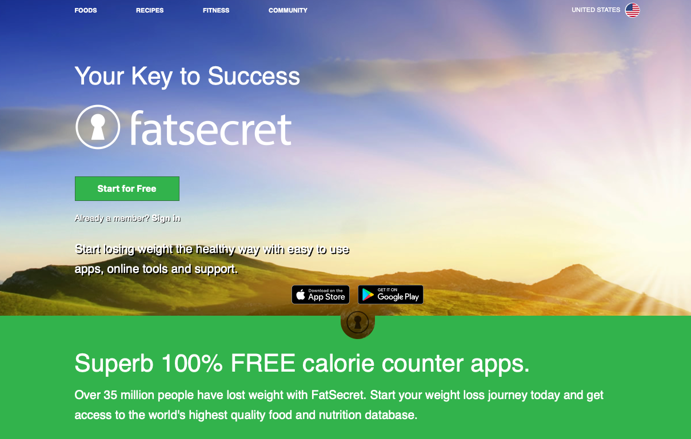
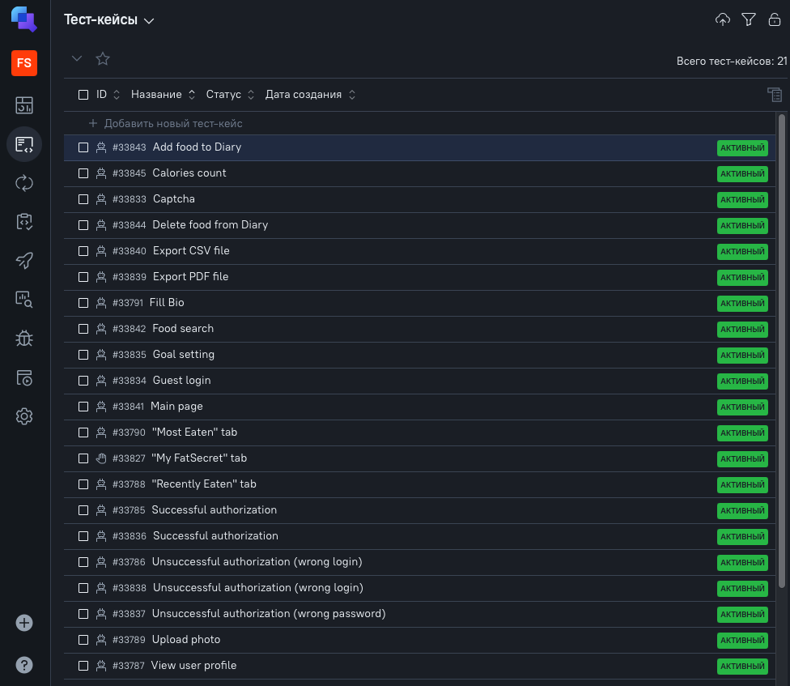
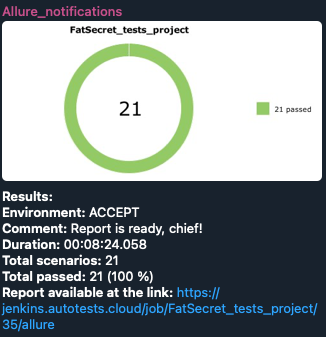

<h1> Тестирование фитнес-приложения трекинга диеты FatSecret</h1>

> <a target="_blank" href="https://fatsecret.com/">Ссылка на сайт</a>

#### Список проверок, реализованных в автотестах:

#### UI-тестирование:

* ✅ Проверка авторизации (позитивные и негативные сценарии)
* ✅ Проверка главной страницы (наличие всех необходимых графических и функциональных элементов)
* ✅ Проверка функционала поиска продукта
* ✅ Проверка функционала добавления продукта в дневник диеты
* ✅ Проверка функицонала удаления продукта из дневника диеты
* ✅ Проверка корректности подсчета каллорий в дневнике диеты
* ✅ Проверка функционала экспорта дневника диеты в файл формата PDF
* ✅ Проверка функционала экспорта дневника диеты в файл формата CSV

#### API-тестирование:

* ✅ Проверка авторизации (позитивные и негативные сценарии)
* ✅ Проверка функционала подгрузки ранее выбранных продуктов во вкладку Recently Eaten
* ✅ Проверка функционала подгрузки часто выбираемых продуктов во вкладку Most Eaten
* ✅ Проверка корректного перехода на страницу профиля пользователя
* ✅ Проверка функционала заполнения поля Bio
* ✅ Проверка функционала добавления фото в профиль пользователя

#### Мобильное тестирование:

* ✅ Проверка появления капча-теста при авторизации в приложении
* ✅ Проверка возможности гостевой авторизации в приложении
* ✅ Проверка кастомизации интерфейса в зависимости от выбора пользователем фитнес-цели

----

## Технологии и инструменты

## Технологии и инструменты

           

----

### Запуск автотестов выполняется на сервере Jenkins

> <a target="_blank" href="FatSecret_tests_project/">Ссылка на проект в Jenkins</a>

#### Для запуска автотестов в Jenkins

1. Открыть <a target="_blank" href="https://jenkins.autotests.cloud/job/FatSecret_tests_project/">Проект в Jenkins</a>
2. Выбрать пункт `Build with Parameters`
3. Выбрать окружение в выпадающем списке ENVIRONMENT
4. Указать комментарий в поле COMMENT
7. Нажать кнопку `Build`
8. Результат запуска сборки можно посмотреть в отчёте Allure

----

### Allure-отчет

#### Общие результаты

#### Список тест-кейсов

----

### Allure TestOps

#### Общий список всех кейсов, имеющихся в системе

#### Пример dashboard с результатами тестирования

----

### Интеграция с Jira

----

### Оповещение о результатах прохождения тестов в Telegram

### Пример видео прохождения автотеста

